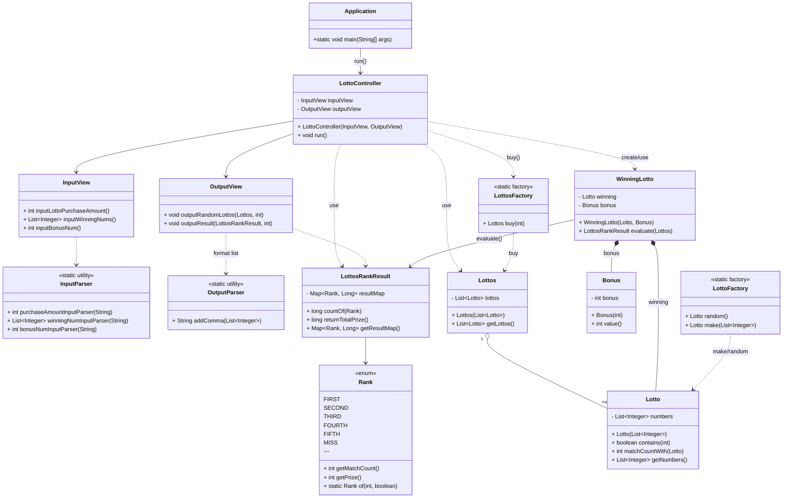

# java-lotto-precourse

---

## 🧾 개요
사용자로부터 **구입 금액**, **당첨 번호**, **보너스 번호**를 입력받아  
발행된 로또 번호를 출력하고, **당첨 결과 및 수익률**을 계산하는 프로그램입니다.

---

```plaintext
src
├── main
│   └── java
│       └── lotto
│           ├── Application.java
│           ├── controller
│           │   └── LottoController.java
│           ├── domain
│           │   ├── Bonus.java
│           │   ├── Lotto.java
│           │   ├── Lottos.java
│           │   ├── LottosRankResult.java
│           │   ├── Rank.java
│           │   └── WinningLotto.java
│           ├── factory
│           │   ├── LottoFactory.java
│           │   └── LottosFactory.java
│           ├── parser
│           │   ├── InputParser.java
│           │   └── OutputParser.java
│           └── view
│               ├── InputView.java
│               └── OutputView.java
└── test
    └── java
        └── lotto
            ├── ApplicationTest.java
            ├── InputParserTest.java
            ├── LottoTest.java
            └── LottosRankResultTest.java
```




## ⚙️ 기능 요약

### 🎲 도메인 규칙
| 항목 | 설명 |
|------|------|
| 번호 범위 | 1 ~ 45 |
| 로또 1장 | 중복되지 않는 6개의 숫자 |
| 당첨 번호 | 6개 + 보너스 1개 (보너스는 메인 번호와 중복 불가) |
| 가격 | 1,000원 / 장 |

#### 💰 당첨 기준 및 상금
| 등수 | 조건 | 상금 |
|------|------|------|
| 1등 | 6개 번호 일치 | 2,000,000,000원 |
| 2등 | 5개 번호 + 보너스 번호 일치 | 30,000,000원 |
| 3등 | 5개 번호 일치 | 1,500,000원 |
| 4등 | 4개 번호 일치 | 50,000원 |
| 5등 | 3개 번호 일치 | 5,000원 |
| 낙첨 | 그 외 | 0원 |

---

## 💻 입·출력 흐름

### 1️⃣ 구입 금액 입력
- 입력된 금액을 1,000으로 나눈 장수만큼 로또 발행
- 예시: (구입금액을 입력해 주세요. -> 8000)

→ **8개를 구매했습니다.**  
[8, 21, 23, 41, 42, 43]  
[3, 5, 11, 16, 32, 38] ...

#### 🔒 예외 처리
- 1,000원 단위가 아닐 경우 → `[ERROR] 금액은 1000원 단위여야 합니다.`
- 음수 또는 0 입력 → `[ERROR] 구입 금액은 0보다 커야 합니다.`
- `int` 범위를 초과할 경우 → `[ERROR] 입력 금액이 너무 큽니다.`

---

### 2️⃣ 당첨 번호 입력
- 입력 형식 예시: `"1,2,3,4,5,6"`
- 입력값 파싱 및 검증 후 저장

#### 🔒 예외 처리
| 상황 | 예시 | 예외 메시지 |
|------|------|-------------|
| 중복 번호 입력 | `1,2,3,3,4,5` | `[ERROR] 당첨 번호는 중복될 수 없습니다.` |
| 구분자 오류 | `1.2.3.4.5.6` | `[ERROR] 구분자는 쉼표(,)만 사용할 수 있습니다.` |
| 번호 개수 오류 | `1,2,3` or `1,2,3,4,5,6,7` | `[ERROR] 당첨 번호는 6개여야 합니다.` |
| 범위 초과 | `0,1,2,3,4,5` or `46,2,3,4,5,6` | `[ERROR] 번호는 1~45 범위여야 합니다.` |
| 비숫자 입력 | `a,1,2,3,4,5` | `[ERROR] 숫자만 입력해야 합니다.` |

---

### 3️⃣ 보너스 번호 입력
- 입력 형식 예시: `"7"`

#### 🔒 예외 처리
| 상황 | 예시 | 예외 메시지 |
|------|------|-------------|
| 메인 번호와 중복 | 메인 번호에 7 포함 시 `"7"` 입력 | `[ERROR] 보너스 번호는 메인 번호와 중복될 수 없습니다.` |
| 범위 초과 | `"0"` or `"46"` | `[ERROR] 번호는 1~45 범위여야 합니다.` |
| 비숫자 입력 | `"a"` | `[ERROR] 숫자만 입력해야 합니다.` |

---

### 4️⃣ 당첨 결과 집계 출력

- 3개 일치 (5,000원) - 1개
- 4개 일치 (50,000원) - 0개
- 5개 일치 (1,500,000원) - 0개
- 5개 일치, 보너스 볼 일치 (30,000,000원) - 0개
- 6개 일치 (2,000,000,000원) - 0개
- 총 수익률은 62.5%입니다.

---

## 📊 수익률 계산
- **공식:**  
- 수익률(%) = (총 당첨금 합계 / 총 구입금액) × 100
- 소수점 둘째 자리에서 반올림
- 예시: `62.48 → 62.5%`

---

## 🚨 예외 처리 정책
- 모든 잘못된 입력은  
  `IllegalArgumentException` 또는 `IllegalStateException`으로 처리
- 에러 메시지는 반드시 **"[ERROR] "**로 시작
- 예외 발생 시 **그 입력 단계부터 재입력**
- `Exception` 등 포괄 예외는 사용 금지

---


